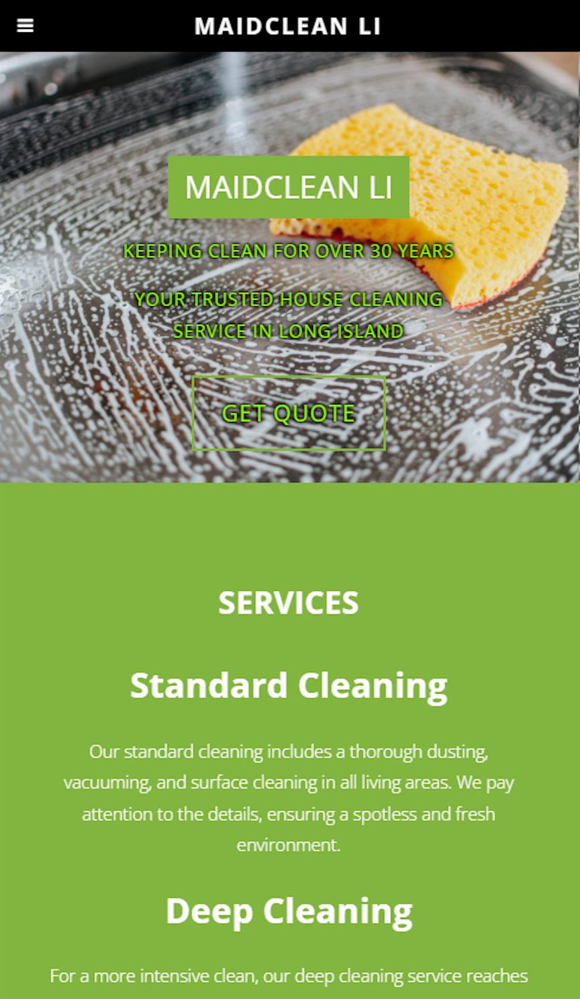

<h1 align="center">MaidClean LI: <a target="_blank" href="https://jordan-russo.github.io/mainclean-li//">Visit Here</a></h1>

 

## Tech used: 

This swift project was focused on making a short but sweet client single-page website that had intuitive fixed navigation and responsive behavior.

## Optimizations

When I improve this project, I will address any issues of initial flashes of unstyled content on page load.

## Lessons Learned:

I learned that taking an adaptive approach to styling instead of a responsive methodology is a bad approach. It leads to more work and dealing with every exception instead of going down the path of least resistance and then adding media queries to handle more difficult styling from there.
